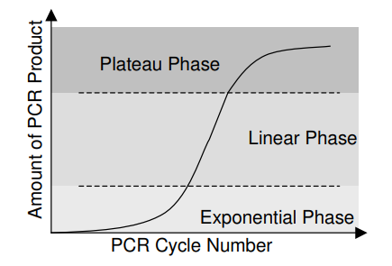
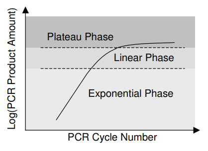

```{r setup, include = F}
# @@@@@@@@@@@@@@@@@@@@@@@@@@@@@@@@@@@@@@@@@@@@@@@@@@
# @@@@@ Knitr Options
# @@@@@@@@@@@@@@@@@@@@@@@@@@@@@@@@@@@@@@@@@@@@@@@@@@

# Set root directory to the project directory
knitr::opts_knit$set(root.dir = rprojroot::find_rstudio_root_file())


# Set default knitr options: 
# Suppress warnings and messages, cache chunks, 
#  set default figure size to 6x8 at 300 dpi, and save a png and pdf
knitr::opts_chunk$set(warning = F, message = F, collapse = T, cache = T,
    fig.height = 6, fig.width = 8, dpi = 300, # 6x8" @ 300dpi:1800x2400=4.3MP
    dev = c('png', 'pdf'), dev.args = list(pdf = list(onefile = F)))

```

```{r Main_Code, include = F, cache = F}

# @@@@@@@@@@@@@@@@@@@@@@@@@@@@@@@@@@@@@@@@@@@@@@@@@@
# @@@@@ Setup - This code is run, but output is hidden
# @@@@@@@@@@@@@@@@@@@@@@@@@@@@@@@@@@@@@@@@@@@@@@@@@@

# Load Packages
library(tidyverse) # Needed for data wrangling: dplyr, tidyr, ggplot2
library(cowplot) # Needed for publication-quality ggplots
library(emmeans) # Needed for estimated marginal means
library(car) # Needed for extracting individual F stats from the MANOVA
library(multcomp) # Needed for compact letter displays
library(lme4)
library(sjPlot)
library(lmerTest)
library(knitr)

# @@@@@@@@@@@@@@@@@@@@@@@@@@@@@@@@@@@@@@@@@@@@@@@@@@
# @@@@@ Data Preparation
# @@@@@@@@@@@@@@@@@@@@@@@@@@@@@@@@@@@@@@@@@@@@@@@@@@

# Import datasets
defense1 <- read.csv("data/defense.genes.csv")

pemv1 <- read.csv("data/pemv.genes.csv")

```


## Overview

This is an analysis of Chase's qRT-PCR data.
Results are displayed as the fold change difference in gene expression between the *no rhizobia* (control) condition and the *rhizobia* (treatment) condition.

* Fold changes > 1 represent upregulation in the *rhizobia* condition relative to *no rhizobia*

* Fold changes < 1 represent downregulation in the *rhizobia* condition relative to *no rhizobia*


## How the $\2^{-\Delta \Delta Ct}$ method works:

Expression of the gene of interest is measured and calibrated to a reference gene.

The $\Delta\Delta Ct$ is the normalized difference in gene expression between a gene of interest in control and treatment conditions:

$$\Delta\Delta Ct = \Delta Ct_{reference.gene} - \Delta Ct_{target.gene}$$
where,
$$\Delta Ct_{reference.gene} = (Ct_{control} - Ct_{treatment})_{ref.gene}$$
and
$$\Delta Ct_{target.gene} = (Ct_{control} - Ct_{treatment})_{target.gene}$$
Visually, this table represents the data needed:
```{r table_demo, echo = F}
Control <- c("A", "C")
Treatment <- c("B", "D")
demo <- data.frame(Control, Treatment)
rownames(demo) <- c("Reference gene", "Target gene")

kable(demo, format = 'markdown')

```

Where the above formula becomes:
$$\Delta\Delta Ct = (A - B) - (C - D)$$

Alternatively,
$$\Delta\Delta Ct = (D - B) - (C - A)$$
Or if you prefer no parentheses:
$$\Delta\Delta Ct = A + D - B - C$$
The above 3 equations are equivalent (this can be useful if your data are organized in different ways).

To understand the intuition behind this method we first need to understand what a Ct, or cycle threshold value actually is.



PCR has three phases, an exponential phase, a linear phase, and a plateau phase. PCR product will essentially double with each cycle in the *exponential* phase as reagents are not limited. As reagents become limiting, PCR product will be produced *linearly* with cycle number until some reagents are fully depleted, at which time the PCR product will no longer increase with cycle number, defining the *plateau* phase.

Plotting the PCR product with $log_{2}$ transformation will yield a range where PCR product correlates with the original template amount. 



The peak of this range is the transition from the exponential phase to the linear phase which defines the cycle threshold number. 

* Comparing two samples, a higher Ct value means lower expression since it took more PCR cycles to reach the same threshold value of PCR product.

In order for relative quantification of gene expression to be valid, the chosen reference gene needs to have stable expression across treatment conditions. 

That is $\Delta Ct_{reference.gene} \sim 0$ where the expression of the reference gene should only marginally fluctuate across samples and treatments.

* If $\Delta Ct_{reference.gene} = 0$ then,

* A positive $\Delta Ct_{target.gene}$ will result in upregulation:

$$+\Delta Ct_{target} \to -\Delta\Delta Ct \to 2^{-(-\Delta\Delta Ct)} \to FC>1$$
alternatively, 


* A negative $\Delta Ct_{target.gene}$ will result in downregulation:

$$-\Delta Ct_{target} \to +\Delta\Delta Ct \to 2^{-(\Delta\Delta Ct)} \to FC<1$$

## A working example

**Downregulation** is defined by a **higher** Ct value in the treatment condition compared to the control condition. Let's try the calculations with ideal data and with data that have a poor reference gene.

### Proper reference gene:

```{r good_example_table, echo = F}

Control <- c(26.012, 24.149)
Treatment <- c(26.475, 26.688)
ex.tab2 <- data.frame(Control, Treatment)
rownames(ex.tab2) <- c("Reference gene", "Target gene")

A <- 26.012
B <- 26.475
C <- 24.149
D <- 26.688

kable(ex.tab2, format = 'markdown')

```

Our $\Delta Ct_{ref}$ = A - B
```{r example_good_ref1, echo = F}
dCt.ref <- A-B
dCt.ref
```
Not bad, pretty close to 0


Our $\Delta Ct_{target}$ = C - D
```{r example_good_ref2, echo = F}
dCt.target <- C-D
dCt.target
```
Ok, this indicates that our target gene is **downregulated** in the treatment condition.


$\Delta\Delta Ct$ <- (A - B) - (C - D)

```{r example_good_ref3, echo = F}
ddCt <- (A - B) - (C - D)
ddCt
```
Notice that the $\Delta\Delta Ct$ value is **positive**.

Now for the fold change transformation:
$2^{-(\Delta\Delta Ct)}$ or $2^{-(2.076)}$

```{r example_good_ref4, echo = F}
2^-ddCt
```
Our answer falls between 0 and 1 indicating that the target gene is **downregulated**. This result makes sense given the negative $\Delta Ct_{target}$ value.


### Now, a bad reference gene:
This example will use the same values as above for the target gene. Only the reference gene has changed.

```{r bad_example_table, echo = F}

Control <- c(21.903, 24.149)
Treatment <- c(26.475, 26.688)
ex.tab2 <- data.frame(Control, Treatment)
rownames(ex.tab2) <- c("Reference gene", "Target gene")
a <- 21.903
b <- 26.475
c <- 24.149
d <- 26.688

kable(ex.tab2, format = 'markdown')

```

Our $\Delta Ct_{ref}$ = a - b
```{r example_bad_ref1, echo = F}
dCt.ref <- a-b
dCt.ref
```
Terrible, our reference gene is not stable.


Our $\Delta Ct_{target}$ = c - d
```{r example_bad_ref2, echo = F}
dCt.target <- c-d
dCt.target
```
Again, this would indicate that our target gene is **downregulated** in the treatment condition. 


$\Delta\Delta Ct$ <- (a - b) - (c - d)

```{r example_bad_ref3, echo = F}
ddCt <- (a - b) - (c - d)
ddCt
```
Notice that our $\Delta\Delta Ct$ value is now **negative**!


Now for the fold change transformation:
$2^{-(\Delta\Delta Ct)}$ or $2^{-(-2.033)}$
```{r example_bad_ref4, echo = F}
2^-ddCt
```
Now our answer is much greater than 1 indicating that the target gene is highly **upregulated**! Even slight differences in expression of the reference gene can generate spurious results! Here the direction of the effect is completely reversed and our interpretation of the result would be meaningless. 


```{r Data_Wrangling, echo = F, comment = ""}

defense1 <- defense1 %>% 
  #convert characters to factors
  mutate(across(
    c(Rhizo:TechRep),
    as.factor))


pemv1 <- pemv1 %>% 
  mutate(across(
    c(Rhizo:TechRep),
    as.factor))

#########################
# defense genes

deltaCt <- defense1 %>% 
  # pool the technical replicates:
  group_by(Rhizo, Aphid, Cultivar, BioRep) %>% 
  summarise(Btub = mean(Btub),
            AO3 = mean(AO3),
            LOX2 = mean(LOX2),
            PR1 = mean(PR1)) %>% 
  # find the differences between target and reference Ct values (i.e. normalize)
  mutate(AO3Ct = AO3 - Btub,
         LOX2Ct = LOX2 - Btub,
         PR1Ct = PR1 - Btub)

# extract means for exploratory plots
meanDeltaCt <- deltaCt %>% 
  group_by(Rhizo, Aphid, Cultivar) %>% 
  summarise(AO3CtMean = mean(AO3Ct),
            LOX2CtMean = mean(LOX2Ct),
            PR1CtMean = mean(PR1Ct))

########################
# cPEMV2 genes


pemvDCT <- pemv1 %>% 
  # pool the technical replicates:
  group_by(Rhizo, Aphid, Cultivar, BioRep) %>% 
  summarise(Btub = mean(Btub),
            cPEMV2 = mean(cPEMV2)) %>% 
  # find the differences between target and reference Ct values (i.e. normalize)
  mutate(cPEMVCt = cPEMV2 - Btub)

# extract means for exploratory plots
meanPEMVCt <- pemvDCT %>% 
  group_by(Rhizo, Aphid, Cultivar) %>% 
  summarise(pemvCtMean = mean(cPEMVCt))


```


### Did the reference gene perform well as a reference for defense genes?
```{r ref_gene_performance_defense, echo = F}

deltaCt %>% 
  ggplot(aes(x = Btub, fill = Rhizo)) +
  geom_density(alpha = 0.7) +
  facet_wrap(~Cultivar) +
  theme_classic()

```

### Did the reference gene perform well as a reference for cPEMV2?
```{r ref_gene_performance_cPEMV2, echo = F}

pemvDCT %>% 
  ggplot(aes(x = Btub, fill = Rhizo)) +
  geom_density(alpha = 0.7) +
  facet_wrap(~Cultivar) +
  theme_classic()

```

```{r defense_genes_models, echo = F}


# build models with each normalized target gene as a response:
ao3.mod <- lm(AO3Ct ~ Rhizo * Aphid * Cultivar,
                data = deltaCt)

lox2.mod <- lm(LOX2Ct ~ Rhizo * Aphid * Cultivar,
                 data = deltaCt)

pr1.mod <- lm(PR1Ct ~ Rhizo * Aphid * Cultivar,
                data = deltaCt)

# check for normality in residuals:

def.long <- cbind(
  data.frame(resid(ao3.mod)),
  data.frame(resid(lox2.mod)),
  data.frame(resid(pr1.mod)))

colnames(def.long) <- c("AO3Ct", "LOX2Ct", "PR1Ct")

def.long <- def.long %>% 
  pivot_longer(AO3Ct : PR1Ct,
               names_to = "genes",
               values_to = "resids")

def.long %>% 
  ggplot(aes(x = resids)) +
  geom_density() +
  facet_wrap(~ genes) +
  theme_classic()

# Okay, residuals look pretty good.

```

```{r cPEMV2_model, echo = F}
pemv.mod <- lm(cPEMVCt ~ Rhizo * Cultivar,
               data = pemvDCT)

# check diagnostics
#plot_model(pemv.mod, type = "diag")

# there is multicollinearity but everything else is fine
```


## Exploratory plots:

### AO3
```{r AO3_test_plot, echo = F}

ggplot(meanDeltaCt,
       aes(x = Aphid, y = AO3CtMean,
           color = Rhizo, group = Rhizo)) +
  geom_point() +
  geom_line() +
  facet_wrap(~Cultivar) +
  theme_classic()

```

### LOX2
```{r LOX2_test_plot, echo = F}

ggplot(meanDeltaCt,
       aes(x = Aphid, y = LOX2CtMean,
           color = Rhizo, group = Rhizo)) +
  geom_point() +
  geom_line() +
  facet_wrap(~Cultivar) +
  theme_classic()

```

### PR1
```{r PR1_test_plot, echo = F}

ggplot(meanDeltaCt,
       aes(x = Aphid, y = PR1CtMean,
           color = Rhizo, group = Rhizo)) +
  geom_point() +
  geom_line() +
  facet_wrap(~Cultivar) +
  theme_classic()

```


### cPEMV2
```{r cPEMV2_test_plot, echo = F}

ggplot(meanPEMVCt,
       aes(x = Cultivar, y = pemvCtMean,
           color = Rhizo, group = Cultivar)) +
  geom_point(size = 2) +
  geom_line(color = 'gray') +
  theme_classic()

```


### $\2^{-\Delta \Delta Ct}$ calcs
```{r AO3_calcs, echo = F}

# get EM means
ao3.means <- emmeans(ao3.mod, 
        ~ Rhizo * Aphid * Cultivar,
                  adjust = "none", response = T)

# convert to tibble
ao3.means <- as_tibble(ao3.means)

# spread the emmeans for calculations
ao3.means <- ao3.means %>% 
  pivot_wider(id_cols = c(Aphid, Cultivar),
              names_from = Rhizo,
              values_from = c(emmean, SE))

# calculate the metrics
ao3ddCT <- ao3.means %>% 
  mutate(ddCT = emmean_Rhizobia - emmean_NoRhizobia,
         ddSE = (SE_Rhizobia + SE_NoRhizobia)/2,
         ddLCL = ddCT - (1.96 * ddSE),
         ddUCL = ddCT + (1.96 * ddSE),
         FC = 2^-ddCT,
         FClcl = 2^-(ddCT - ddLCL),
         FCucl = 2^-(ddCT + ddUCL))

```


```{r LOX2_calcs, echo = F}

# get EM means
lox2.means <- emmeans(lox2.mod, 
        ~ Rhizo * Aphid * Cultivar,
                  adjust = "none", response = T)

# convert to tibble
lox2.means <- as_tibble(lox2.means)

# spread the emmeans for calculations
lox2.means <- lox2.means %>% 
  pivot_wider(id_cols = c(Aphid, Cultivar),
              names_from = Rhizo,
              values_from = c(emmean, SE))

# calculate the metrics
lox2ddCT <- lox2.means %>% 
  mutate(ddCT = emmean_Rhizobia - emmean_NoRhizobia,
         ddSE = (SE_Rhizobia + SE_NoRhizobia)/2,
         ddLCL = ddCT - (1.96 * ddSE),
         ddUCL = ddCT + (1.96 * ddSE),
         FC = 2^-ddCT,
         FClcl = 2^-(ddCT - ddLCL),
         FCucl = 2^-(ddCT + ddUCL))

```

```{r PR1_calcs, echo = F}

# get EM means
pr1.means <- emmeans(pr1.mod, 
        ~ Rhizo * Aphid * Cultivar,
                  adjust = "none", response = T)

# convert to tibble
pr1.means <- as_tibble(pr1.means)

# spread the emmeans for calculations
pr1.means <- pr1.means %>% 
  pivot_wider(id_cols = c(Aphid, Cultivar),
              names_from = Rhizo,
              values_from = c(emmean, SE))

# calculate the metrics
pr1ddCT <- pr1.means %>% 
  mutate(ddCT = emmean_Rhizobia - emmean_NoRhizobia,
         ddSE = (SE_Rhizobia + SE_NoRhizobia)/2,
         ddLCL = ddCT - (1.96 * ddSE),
         ddUCL = ddCT + (1.96 * ddSE),
         FC = 2^-ddCT,
         FClcl = 2^-(ddCT - ddLCL),
         FCucl = 2^-(ddCT + ddUCL))

```

```{r cPEMV2_calcs, echo = F}

# get EM means
pemv.means <- emmeans(pemv.mod, 
        ~ Rhizo * Cultivar,
                  adjust = "none", response = T)

# convert to tibble
pemv.means <- as_tibble(pemv.means)

# spread the emmeans for calculations
pemv.means <- pemv.means %>% 
  pivot_wider(id_cols = Cultivar,
              names_from = Rhizo,
              values_from = c(emmean, SE))

# calculate the metrics
pemvddCT <- pemv.means %>% 
  mutate(ddCT = emmean_Rhizobia - emmean_NoRhizobia,
         ddSE = (SE_Rhizobia + SE_NoRhizobia)/2,
         ddLCL = ddCT - (1.96 * ddSE),
         ddUCL = ddCT + (1.96 * ddSE),
         FC = 2^-ddCT,
         FClcl = 2^-(ddCT - ddLCL),
         FCucl = 2^-(ddCT + ddUCL))

```

## Figures

### AO3
```{r ao3_fig, echo = F}

ao3ddCT %>% 
  ggplot(aes(x = Aphid, y = FC, group = Cultivar)) +
  geom_point() +
  geom_line() +
  facet_wrap(~ Cultivar) +
  theme_classic() +
  labs(x = "Aphid treatment",
       y = "Fold change in AO3 expression\nbetween rhizobia treatments") +
  geom_hline(yintercept = 1, linetype = 'dashed')

```

### LOX2
```{r lox2_fig, echo = F}

lox2ddCT %>% 
  ggplot(aes(x = Aphid, y = FC, group = Cultivar)) +
  geom_point() +
  geom_line() +
  facet_wrap(~ Cultivar) +
  theme_classic() +
  labs(x = "Aphid treatment",
       y = "Fold change in LOX2 expression\nbetween rhizobia treatments") +
  geom_hline(yintercept = 1, linetype = 'dashed')

```


### PR1
```{r pr1_fig, echo = F}

pr1ddCT %>% 
  ggplot(aes(x = Aphid, y = FC, group = Cultivar)) +
  geom_point() +
  geom_line() +
  facet_wrap(~ Cultivar) +
  theme_classic() +
  labs(x = "Aphid treatment",
       y = "Fold change in PR1 expression\nbetween rhizobia treatments") +
  geom_hline(yintercept = 1, linetype = 'dashed')

```

### cPEMV2
```{r cpemv2_fig, echo = F}

pemvddCT %>% 
  ggplot(aes(x = Cultivar, y = FC, group = )) +
  geom_point() +
  theme_classic() +
  labs(x = "Cultivar",
       y = "Fold change in cPEMV2 expression\nbetween rhizobia treatments") +
  geom_hline(yintercept = 1, linetype = 'dashed')

```

## Session Information

```{r Session_Info, echo = F, comment = ""}

# Add session information to help with reproduceability
sessionInfo()


```


