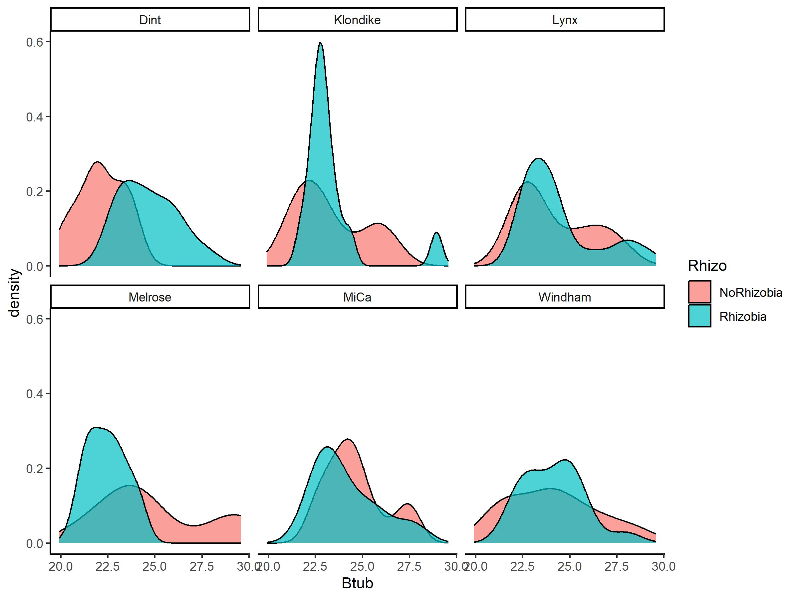
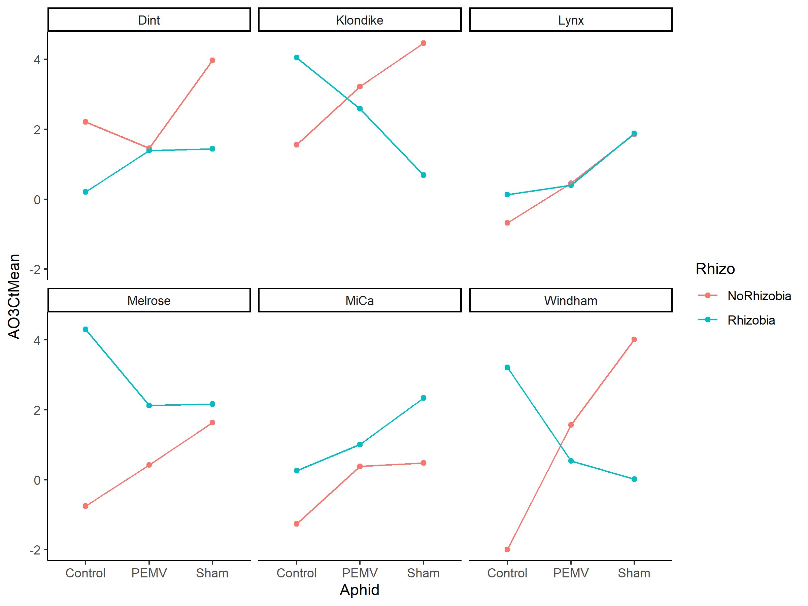
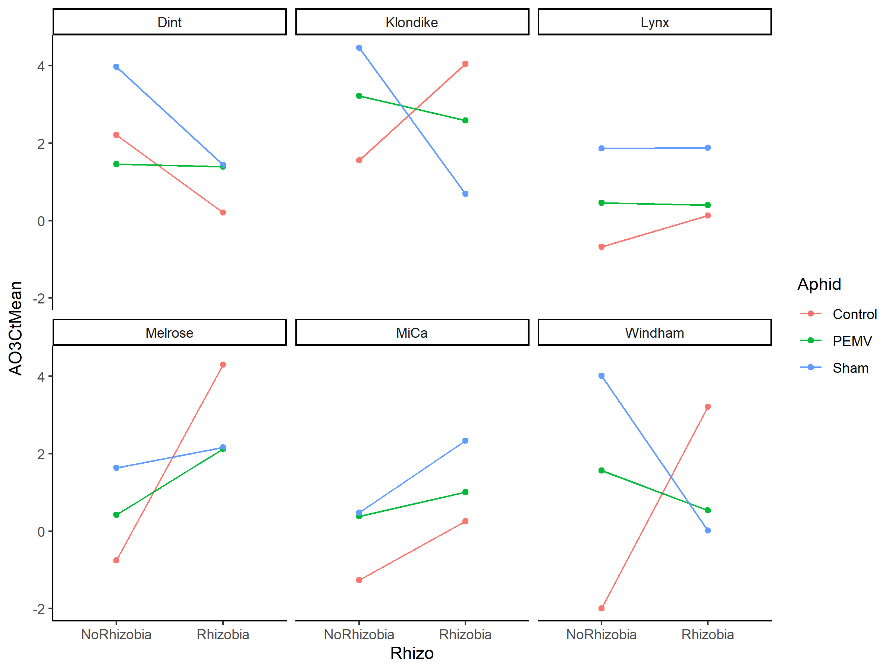
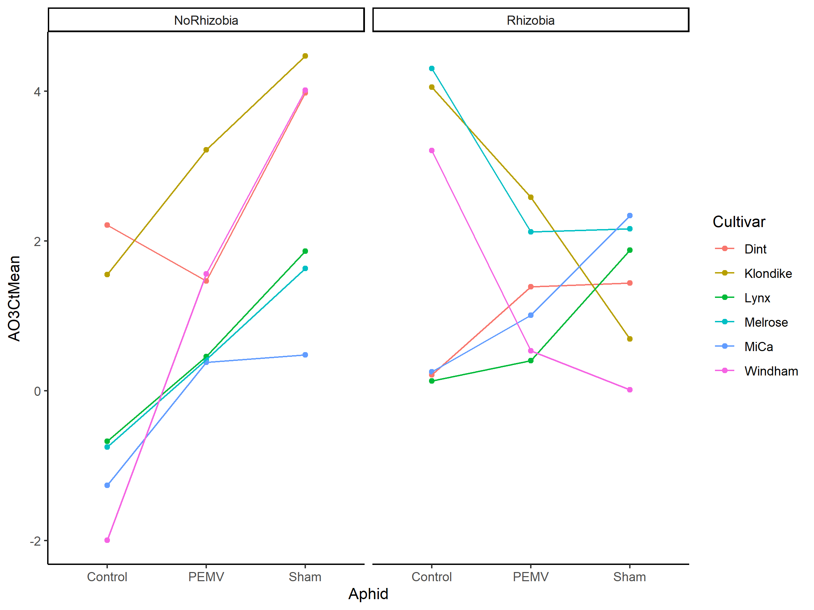
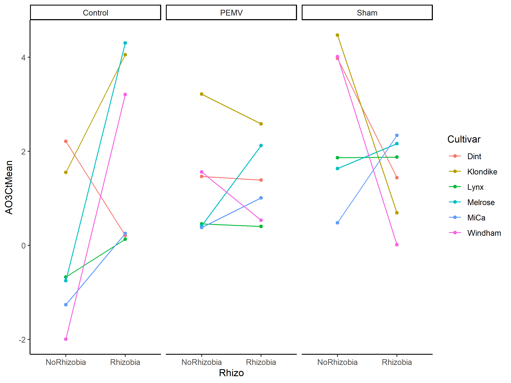
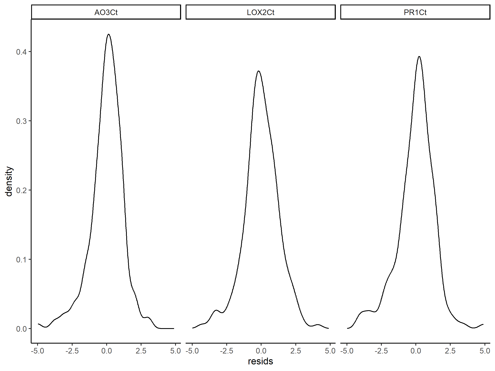

Winter Pea qRT-PCR
================
Riley M. Anderson & Chase Baerlocher
February 05, 2024

  

- [Overview](#overview)
  - [Summary of Results](#summary-of-results)
- [Clark-Anderson
  
  method](#clark-anderson-2-delta-delta-ct-method)
- [Did the reference rene perform well as a
  reference?](#did-the-reference-rene-perform-well-as-a-reference)
  - [Session Information](#session-information)

## Overview

What is this analysis about?

### Summary of Results

- 

## Clark-Anderson  method

# Did the reference rene perform well as a reference?

<!-- -->

    ## 
    ## Call:
    ## lm(formula = AO3Ct ~ Rhizo * Aphid * Cultivar, data = deltaCt)
    ## 
    ## Residuals:
    ##     Min      1Q  Median      3Q     Max 
    ## -4.9833 -0.5561  0.0961  0.6745  3.0750 
    ## 
    ## Coefficients:
    ##                                          Estimate Std. Error t value Pr(>|t|)
    ## (Intercept)                               2.21167    0.51807   4.269 3.21e-05
    ## RhizoRhizobia                            -1.99900    0.76843  -2.601 0.010079
    ## AphidPEMV                                -0.74611    0.73267  -1.018 0.309918
    ## AphidSham                                 1.76667    0.73267   2.411 0.016931
    ## CultivarKlondike                         -0.65722    0.73267  -0.897 0.370937
    ## CultivarLynx                             -2.88722    0.73267  -3.941 0.000117
    ## CultivarMelrose                          -2.96278    0.73267  -4.044 7.87e-05
    ## CultivarMiCa                             -3.47333    0.73267  -4.741 4.40e-06
    ## CultivarWindham                          -4.20667    0.73267  -5.742 4.07e-08
    ## RhizoRhizobia:AphidPEMV                   1.92567    1.06174   1.814 0.071437
    ## RhizoRhizobia:AphidSham                  -0.53767    1.06174  -0.506 0.613211
    ## RhizoRhizobia:CultivarKlondike            4.50122    1.12316   4.008 9.06e-05
    ## RhizoRhizobia:CultivarLynx                2.80678    1.06174   2.644 0.008949
    ## RhizoRhizobia:CultivarMelrose             7.05400    1.06174   6.644 3.72e-10
    ## RhizoRhizobia:CultivarMiCa                3.51511    1.06174   3.311 0.001130
    ## RhizoRhizobia:CultivarWindham             7.20456    1.06174   6.786 1.72e-10
    ## AphidPEMV:CultivarKlondike                2.41167    1.03615   2.328 0.021081
    ## AphidSham:CultivarKlondike                1.14889    1.03615   1.109 0.269035
    ## AphidPEMV:CultivarLynx                    1.88111    1.03615   1.815 0.071161
    ## AphidSham:CultivarLynx                    0.77278    1.03615   0.746 0.456778
    ## AphidPEMV:CultivarMelrose                 1.91667    1.03615   1.850 0.066029
    ## AphidSham:CultivarMelrose                 0.62000    1.03615   0.598 0.550367
    ## AphidPEMV:CultivarMiCa                    2.39000    1.03615   2.307 0.022248
    ## AphidSham:CultivarMiCa                   -0.02222    1.03615  -0.021 0.982914
    ## AphidPEMV:CultivarWindham                 4.30444    1.03615   4.154 5.09e-05
    ## AphidSham:CultivarWindham                 4.24556    1.03615   4.097 6.38e-05
    ## RhizoRhizobia:AphidPEMV:CultivarKlondike -5.06189    1.54556  -3.275 0.001273
    ## RhizoRhizobia:AphidSham:CultivarKlondike -5.74122    1.54556  -3.715 0.000273
    ## RhizoRhizobia:AphidPEMV:CultivarLynx     -2.78956    1.48354  -1.880 0.061723
    ## RhizoRhizobia:AphidSham:CultivarLynx     -0.25289    1.48354  -0.170 0.864843
    ## RhizoRhizobia:AphidPEMV:CultivarMelrose  -5.27733    1.48354  -3.557 0.000482
    ## RhizoRhizobia:AphidSham:CultivarMelrose  -3.98678    1.48354  -2.687 0.007897
    ## RhizoRhizobia:AphidPEMV:CultivarMiCa     -2.81289    1.48354  -1.896 0.059599
    ## RhizoRhizobia:AphidSham:CultivarMiCa      0.87767    1.48354   0.592 0.554879
    ## RhizoRhizobia:AphidPEMV:CultivarWindham  -8.16011    1.48354  -5.500 1.33e-07
    ## RhizoRhizobia:AphidSham:CultivarWindham  -8.66844    1.48354  -5.843 2.45e-08
    ##                                             
    ## (Intercept)                              ***
    ## RhizoRhizobia                            *  
    ## AphidPEMV                                   
    ## AphidSham                                *  
    ## CultivarKlondike                            
    ## CultivarLynx                             ***
    ## CultivarMelrose                          ***
    ## CultivarMiCa                             ***
    ## CultivarWindham                          ***
    ## RhizoRhizobia:AphidPEMV                  .  
    ## RhizoRhizobia:AphidSham                     
    ## RhizoRhizobia:CultivarKlondike           ***
    ## RhizoRhizobia:CultivarLynx               ** 
    ## RhizoRhizobia:CultivarMelrose            ***
    ## RhizoRhizobia:CultivarMiCa               ** 
    ## RhizoRhizobia:CultivarWindham            ***
    ## AphidPEMV:CultivarKlondike               *  
    ## AphidSham:CultivarKlondike                  
    ## AphidPEMV:CultivarLynx                   .  
    ## AphidSham:CultivarLynx                      
    ## AphidPEMV:CultivarMelrose                .  
    ## AphidSham:CultivarMelrose                   
    ## AphidPEMV:CultivarMiCa                   *  
    ## AphidSham:CultivarMiCa                      
    ## AphidPEMV:CultivarWindham                ***
    ## AphidSham:CultivarWindham                ***
    ## RhizoRhizobia:AphidPEMV:CultivarKlondike ** 
    ## RhizoRhizobia:AphidSham:CultivarKlondike ***
    ## RhizoRhizobia:AphidPEMV:CultivarLynx     .  
    ## RhizoRhizobia:AphidSham:CultivarLynx        
    ## RhizoRhizobia:AphidPEMV:CultivarMelrose  ***
    ## RhizoRhizobia:AphidSham:CultivarMelrose  ** 
    ## RhizoRhizobia:AphidPEMV:CultivarMiCa     .  
    ## RhizoRhizobia:AphidSham:CultivarMiCa        
    ## RhizoRhizobia:AphidPEMV:CultivarWindham  ***
    ## RhizoRhizobia:AphidSham:CultivarWindham  ***
    ## ---
    ## Signif. codes:  0 '***' 0.001 '**' 0.01 '*' 0.05 '.' 0.1 ' ' 1
    ## 
    ## Residual standard error: 1.269 on 175 degrees of freedom
    ## Multiple R-squared:  0.6484, Adjusted R-squared:  0.578 
    ## F-statistic: 9.219 on 35 and 175 DF,  p-value: < 2.2e-16

<!-- --><!-- --><!-- --><!-- --><!-- -->

## Session Information

    R version 4.2.3 (2023-03-15 ucrt)
    Platform: x86_64-w64-mingw32/x64 (64-bit)
    Running under: Windows 10 x64 (build 19045)

    Matrix products: default

    locale:
    [1] LC_COLLATE=English_United States.utf8 
    [2] LC_CTYPE=English_United States.utf8   
    [3] LC_MONETARY=English_United States.utf8
    [4] LC_NUMERIC=C                          
    [5] LC_TIME=English_United States.utf8    

    attached base packages:
    [1] stats     graphics  grDevices utils     datasets  methods   base     

    other attached packages:
     [1] lmerTest_3.1-3  sjPlot_2.8.13   lme4_1.1-32     Matrix_1.5-3   
     [5] multcomp_1.4-25 TH.data_1.1-2   MASS_7.3-58.2   survival_3.5-3 
     [9] mvtnorm_1.1-3   car_3.1-2       carData_3.0-5   emmeans_1.8.5  
    [13] cowplot_1.1.1   lubridate_1.9.2 forcats_1.0.0   stringr_1.5.0  
    [17] dplyr_1.1.1     purrr_1.0.1     readr_2.1.4     tidyr_1.3.0    
    [21] tibble_3.2.1    ggplot2_3.4.1   tidyverse_2.0.0

    loaded via a namespace (and not attached):
     [1] Rcpp_1.0.10         lattice_0.20-45     zoo_1.8-12         
     [4] rprojroot_2.0.3     digest_0.6.31       utf8_1.2.3         
     [7] R6_2.5.1            backports_1.4.1     evaluate_0.20      
    [10] coda_0.19-4         pillar_1.9.0        rlang_1.1.0        
    [13] rstudioapi_0.14     minqa_1.2.5         performance_0.10.2 
    [16] nloptr_2.0.3        rmarkdown_2.21      ggeffects_1.2.0    
    [19] splines_4.2.3       munsell_0.5.0       broom_1.0.4        
    [22] numDeriv_2016.8-1.1 modelr_0.1.11       compiler_4.2.3     
    [25] xfun_0.38           pkgconfig_2.0.3     htmltools_0.5.5    
    [28] insight_0.19.1      tidyselect_1.2.0    codetools_0.2-19   
    [31] fansi_1.0.4         tzdb_0.3.0          withr_2.5.0        
    [34] sjmisc_2.8.9        grid_4.2.3          nlme_3.1-162       
    [37] xtable_1.8-4        gtable_0.3.3        lifecycle_1.0.3    
    [40] bayestestR_0.13.0   magrittr_2.0.3      scales_1.2.1       
    [43] datawizard_0.7.0    estimability_1.4.1  cli_3.6.1          
    [46] stringi_1.7.12      generics_0.1.3      vctrs_0.6.1        
    [49] boot_1.3-28.1       sandwich_3.0-2      sjlabelled_1.2.0   
    [52] tools_4.2.3         glue_1.6.2          sjstats_0.18.2     
    [55] hms_1.1.3           abind_1.4-5         fastmap_1.1.1      
    [58] yaml_2.3.7          timechange_0.2.0    colorspace_2.1-0   
    [61] knitr_1.42         
