Winter Pea qRT-PCR
================
Riley M. Anderson & Chase Baerlocher
February 06, 2024

  

- [Overview](#overview)
  - [Did the reference gene perform well as a reference for defense
    genes?](#did-the-reference-gene-perform-well-as-a-reference-for-defense-genes)
  - [Did the reference gene perform well as a reference for
    cPEMV2?](#did-the-reference-gene-perform-well-as-a-reference-for-cpemv2)
- [Exploratory plots:](#exploratory-plots)
  - [AO3](#ao3)
  - [LOX2](#lox2)
  - [PR1](#pr1)
  - [cPEMV2](#cpemv2)
  - [
    calcs](#2-delta-delta-ct-calcs)
- [Figures](#figures)
  - [AO3](#ao3-1)
  - [LOX2](#lox2-1)
  - [PR1](#pr1-1)
  - [cPEMV2](#cpemv2-1)
- [Session Information](#session-information)

## Overview

This is an analysis of Chase’s qRT-PCR data. Results are displayed as
the fold change difference in gene expression between the *no rhizobia*
(control) condition and the *rhizobia* (treatment) condition.

- Fold changes \> 1 represent upregulation in the *rhizobia* condition
  relative to *no rhizobia*

- Fold changes \< 1 represent downregulation in the *rhizobia* condition
  relative to *no rhizobia*

### Did the reference gene perform well as a reference for defense genes?

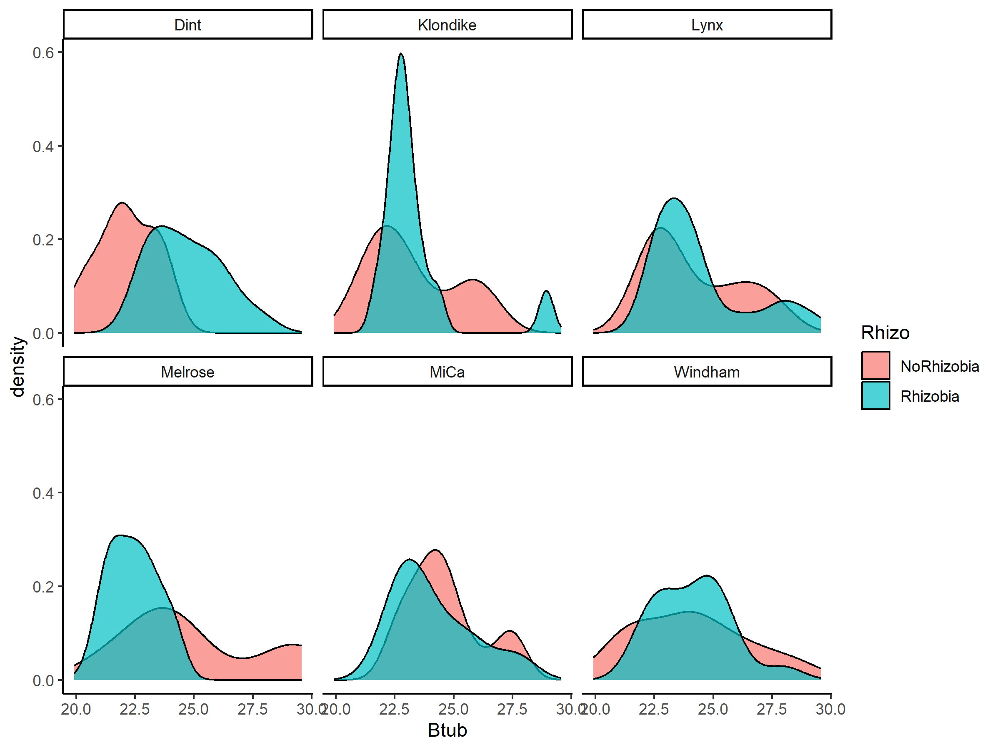<!-- -->

### Did the reference gene perform well as a reference for cPEMV2?

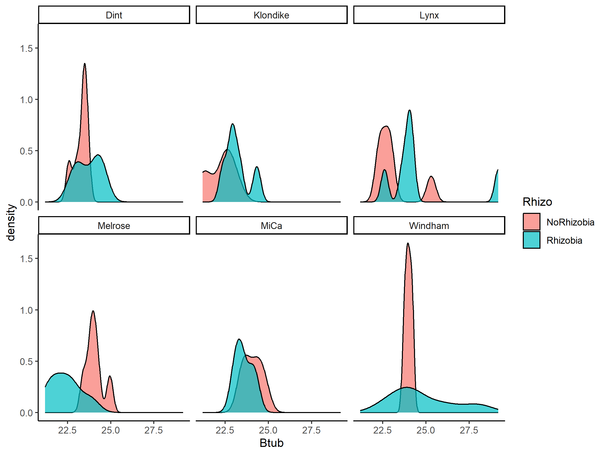<!-- -->

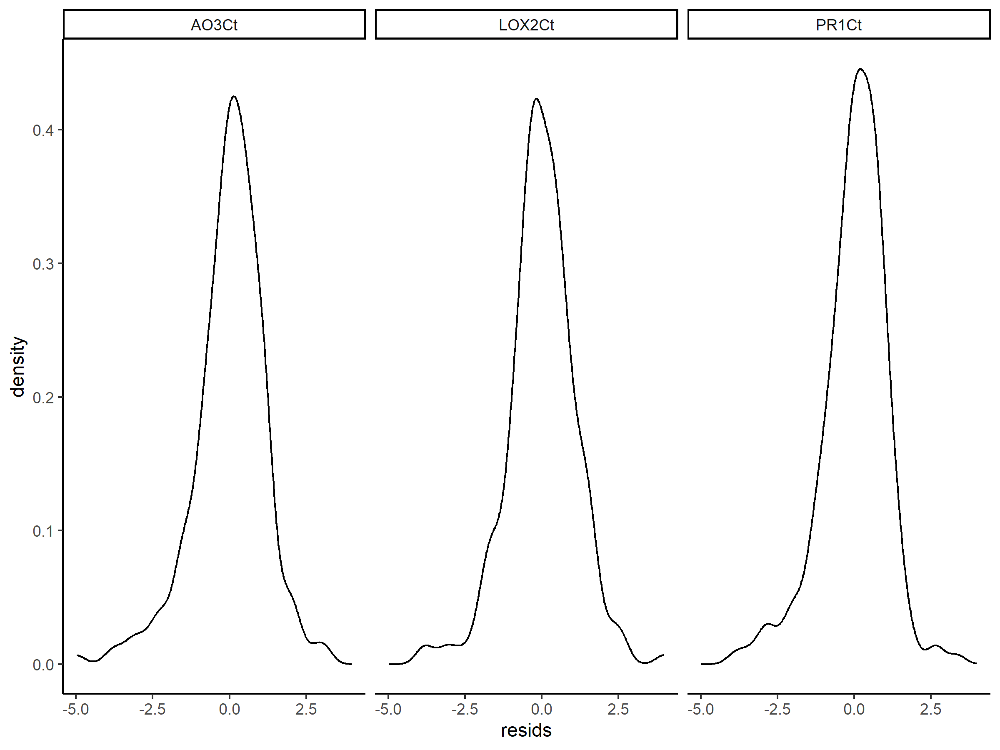<!-- -->

## Exploratory plots:

### AO3

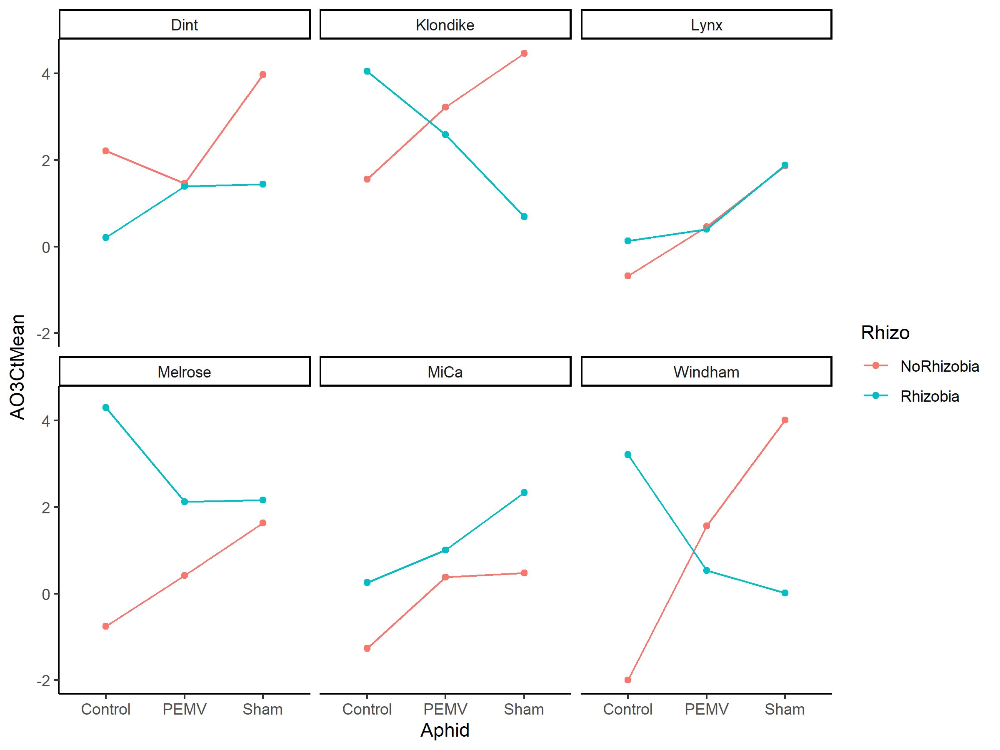<!-- -->

### LOX2

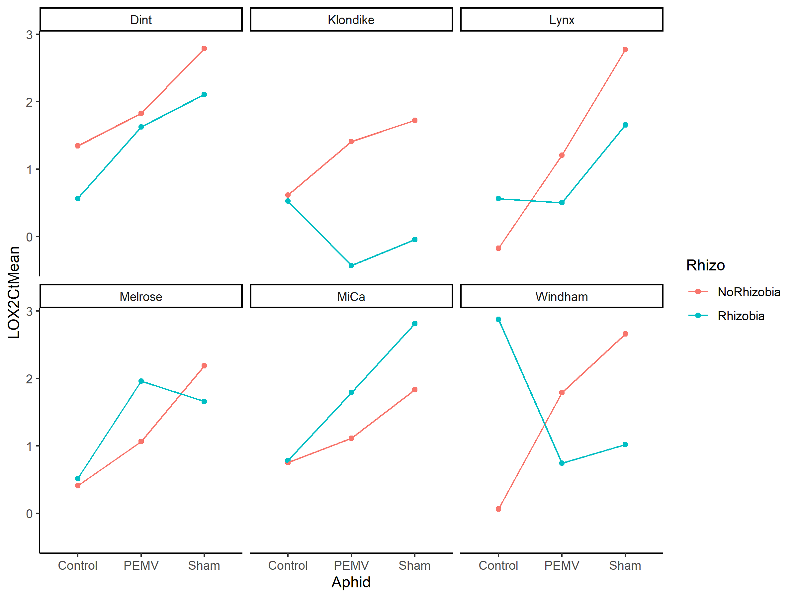<!-- -->

### PR1

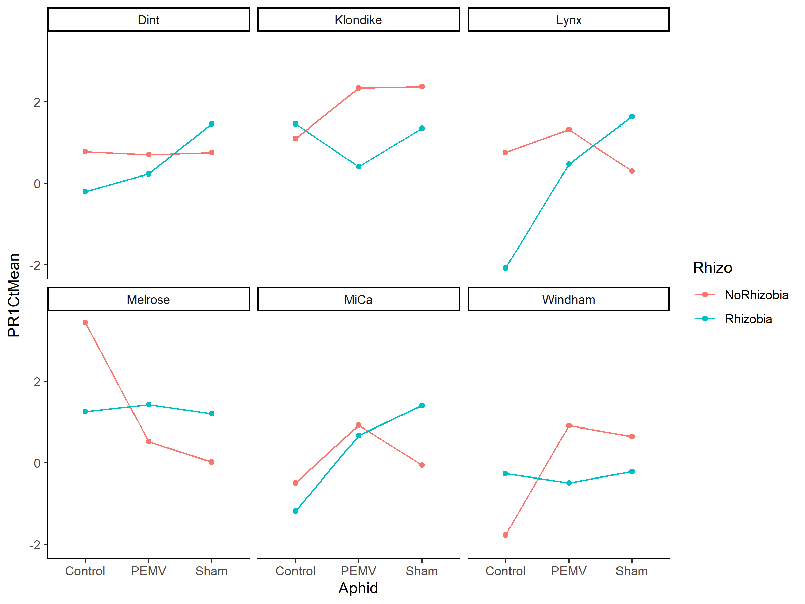<!-- -->

### cPEMV2

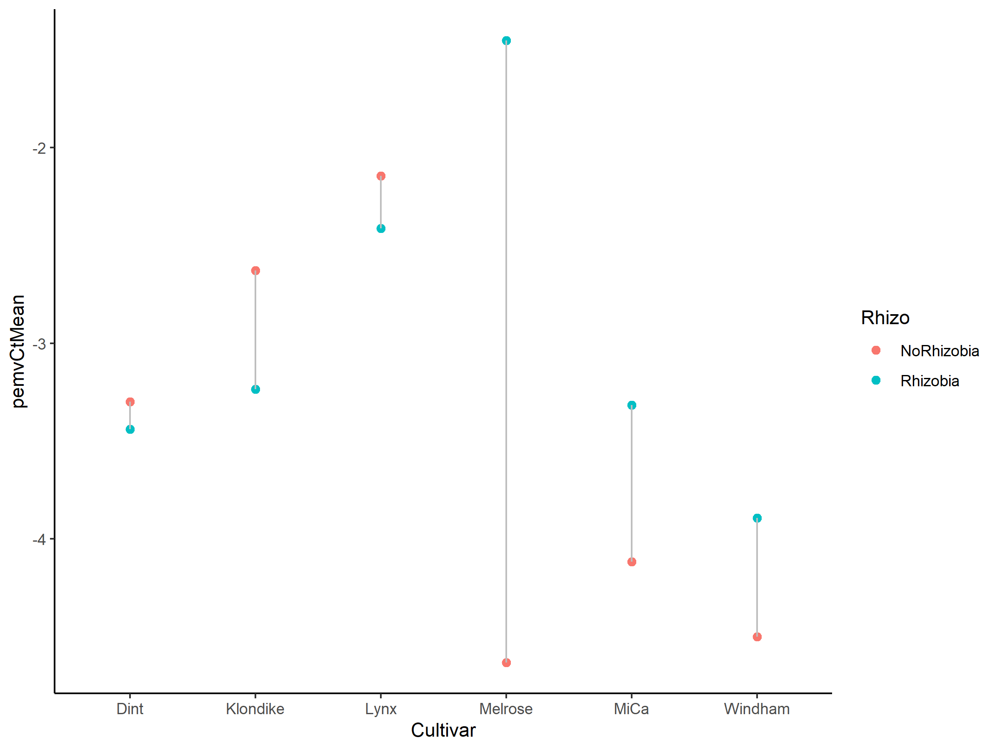<!-- -->

###  calcs

## Figures

### AO3

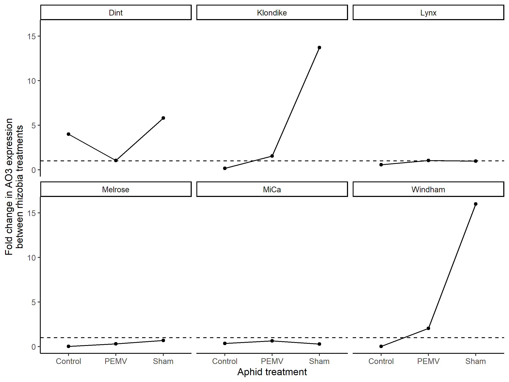<!-- -->

### LOX2

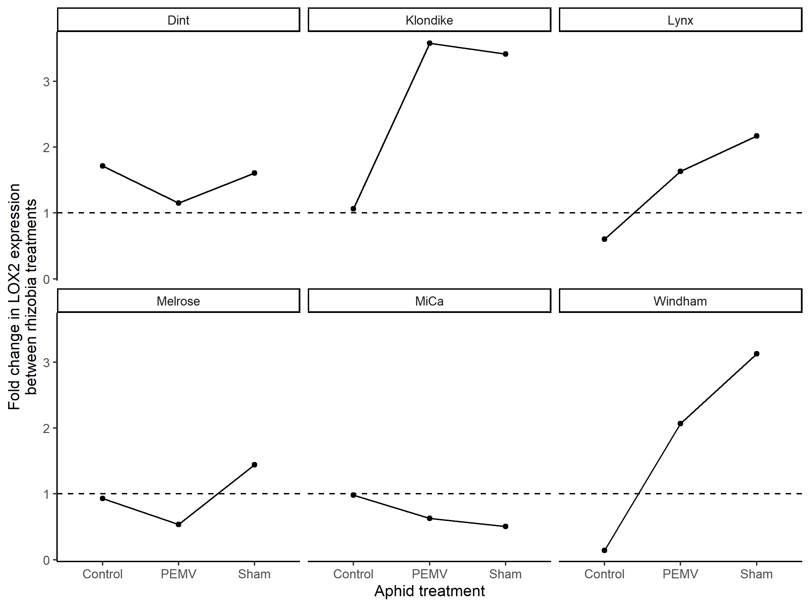<!-- -->

### PR1

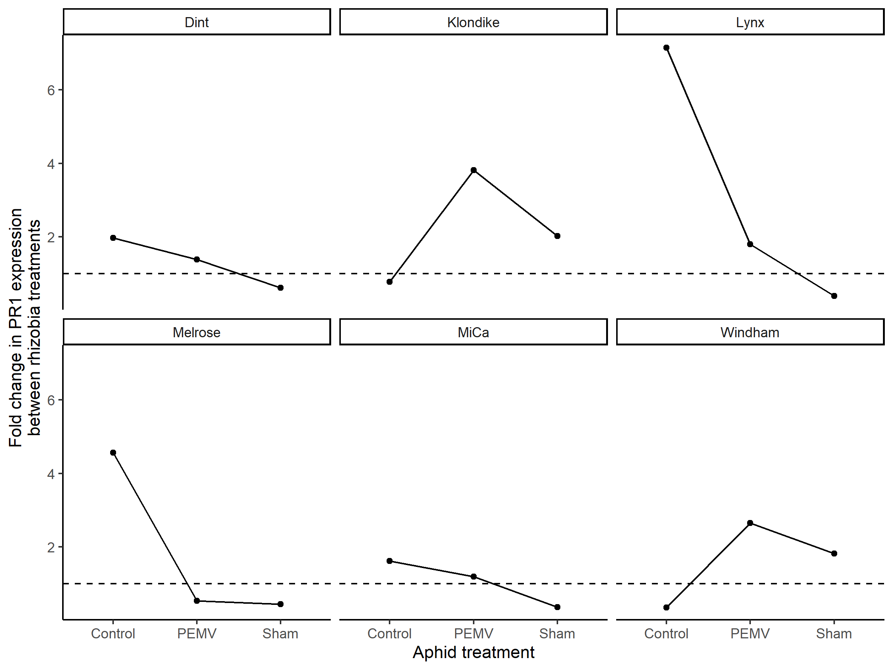<!-- -->

### cPEMV2

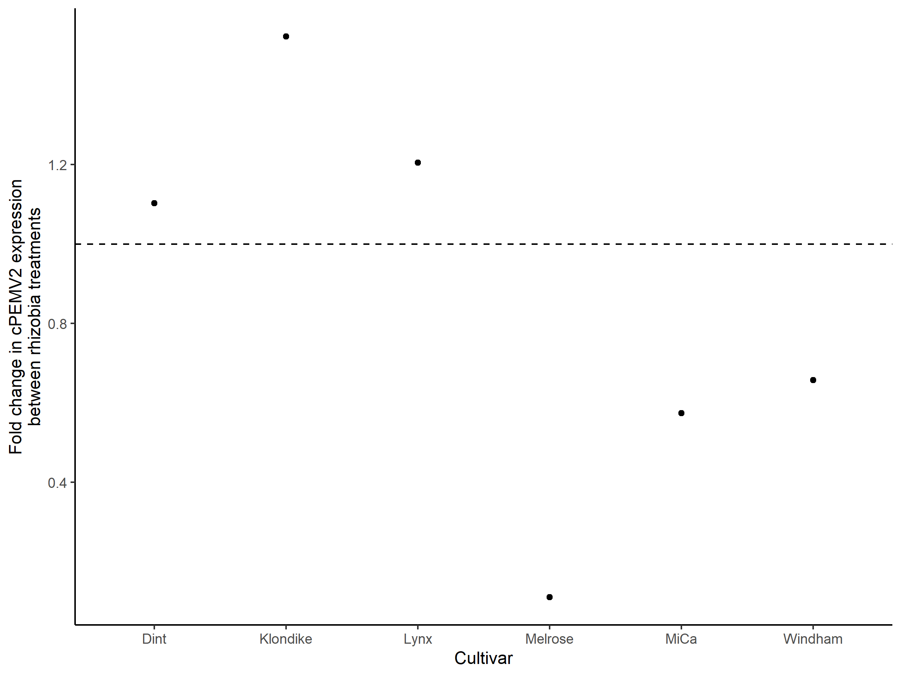<!-- -->

## Session Information

    R version 4.2.3 (2023-03-15 ucrt)
    Platform: x86_64-w64-mingw32/x64 (64-bit)
    Running under: Windows 10 x64 (build 19045)

    Matrix products: default

    locale:
    [1] LC_COLLATE=English_United States.utf8 
    [2] LC_CTYPE=English_United States.utf8   
    [3] LC_MONETARY=English_United States.utf8
    [4] LC_NUMERIC=C                          
    [5] LC_TIME=English_United States.utf8    

    attached base packages:
    [1] stats     graphics  grDevices utils     datasets  methods   base     

    other attached packages:
     [1] lmerTest_3.1-3  sjPlot_2.8.13   lme4_1.1-32     Matrix_1.5-3   
     [5] multcomp_1.4-25 TH.data_1.1-2   MASS_7.3-58.2   survival_3.5-3 
     [9] mvtnorm_1.1-3   car_3.1-2       carData_3.0-5   emmeans_1.8.5  
    [13] cowplot_1.1.1   lubridate_1.9.2 forcats_1.0.0   stringr_1.5.0  
    [17] dplyr_1.1.1     purrr_1.0.1     readr_2.1.4     tidyr_1.3.0    
    [21] tibble_3.2.1    ggplot2_3.4.1   tidyverse_2.0.0

    loaded via a namespace (and not attached):
     [1] Rcpp_1.0.10         lattice_0.20-45     zoo_1.8-12         
     [4] rprojroot_2.0.3     digest_0.6.31       utf8_1.2.3         
     [7] R6_2.5.1            backports_1.4.1     evaluate_0.20      
    [10] coda_0.19-4         pillar_1.9.0        rlang_1.1.0        
    [13] rstudioapi_0.14     minqa_1.2.5         performance_0.10.2 
    [16] nloptr_2.0.3        rmarkdown_2.21      ggeffects_1.2.0    
    [19] splines_4.2.3       munsell_0.5.0       broom_1.0.4        
    [22] numDeriv_2016.8-1.1 modelr_0.1.11       compiler_4.2.3     
    [25] xfun_0.38           pkgconfig_2.0.3     htmltools_0.5.5    
    [28] insight_0.19.1      tidyselect_1.2.0    codetools_0.2-19   
    [31] fansi_1.0.4         tzdb_0.3.0          withr_2.5.0        
    [34] sjmisc_2.8.9        grid_4.2.3          nlme_3.1-162       
    [37] xtable_1.8-4        gtable_0.3.3        lifecycle_1.0.3    
    [40] bayestestR_0.13.0   magrittr_2.0.3      scales_1.2.1       
    [43] datawizard_0.7.0    estimability_1.4.1  cli_3.6.1          
    [46] stringi_1.7.12      generics_0.1.3      vctrs_0.6.1        
    [49] boot_1.3-28.1       sandwich_3.0-2      sjlabelled_1.2.0   
    [52] tools_4.2.3         glue_1.6.2          sjstats_0.18.2     
    [55] hms_1.1.3           abind_1.4-5         fastmap_1.1.1      
    [58] yaml_2.3.7          timechange_0.2.0    colorspace_2.1-0   
    [61] knitr_1.42         
